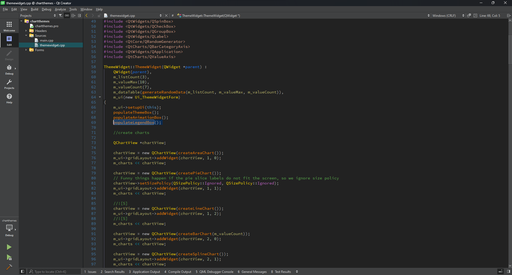

## Enhanced syntax highlighting for Qt Creator **(Updated)**

A dark theme for [Qt Creator](http://qt.io/ide) insprired by [Visual Assist's](https://www.wholetomato.com/) enhanced syntax highlighting in Visual Studio.

**Updated version for Qt Creator 9.0.2 and newer. This fork fixes some unreadable texts when using Qt Creator dark themes.**

## Installation

1. Copy the `visual-assist-enhanced-syntax.xml` file into the Qt Creator styles directory:

    - Linux/Unix/macOS: `~/.config/QtProject/qtcreator/styles`
    - Windows 7/10/11: `<drive>:\Users\<username>\AppData\Roaming\QtProject\qtcreator\styles`

2. In Qt Creator go to `Edit ⟶ Preferences... ⟶ Text Editor ⟶ Font & Colors` and select "Visual Assist X Enhanced Syntax Highlighting" under "Color Scheme".

## Acknowledgements
- The theme is based on an excellent [darcula for Qt Creator](https://github.com/dracula/qtcreator).
- The font used on the screenshot is [Fantasque Sans Mono](https://github.com/belluzj/fantasque-sans).

