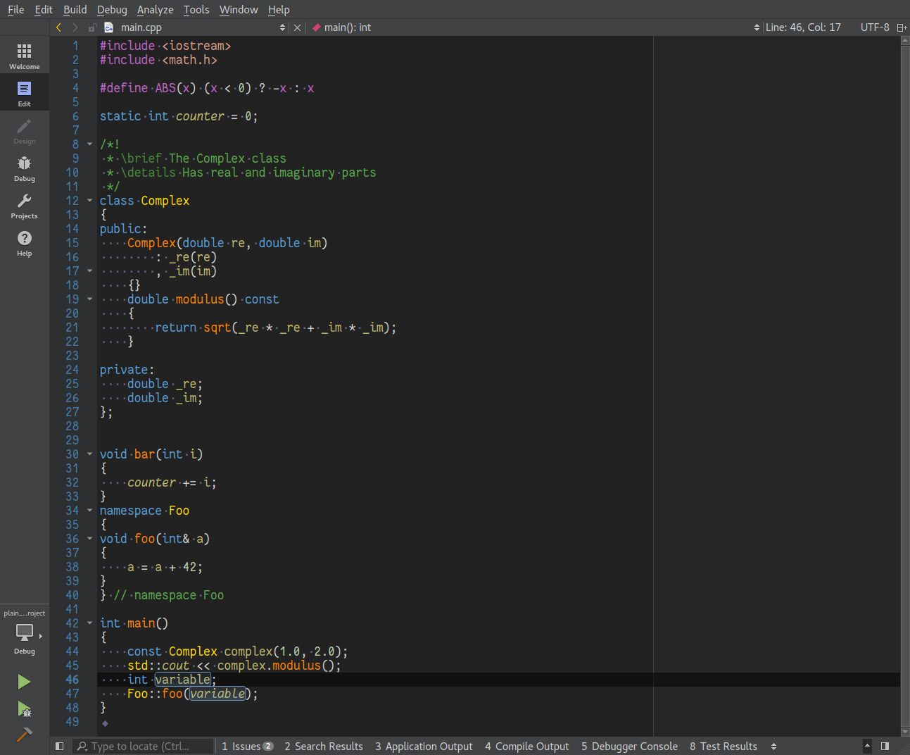

# Visual Assist enhanced syntax highlighting for [Qt Creator](http://qt.io/ide)

A dark theme for [Qt Creator](http://qt.io/ide) insprired by Visual Assist enhanced syntax highlighting in Visual Studio.

## Installation

Copy the `visual-assist-enhanced-syntax.xml` file into the Qt Creator styles directory:

- Unix: `~/.config/QtProject/qtcreator/styles`
- macOS: `~/.config/QtProject/qtcreator/styles`
- Windows XP: `<drive>:\Documents and Settings\<username>\Application Data\QtProject\qtcreator\styles`
- Windows Vista/7/10: `<drive>:\Users\<username>\AppData\Roaming\QtProject\qtcreator\styles`

In Qt Creator go to **`Tools -> Options -> Text Editor -> Font & Colors`** and select "Visual Assist Enhanced Syntax Highlighting" under "Color Scheme".

